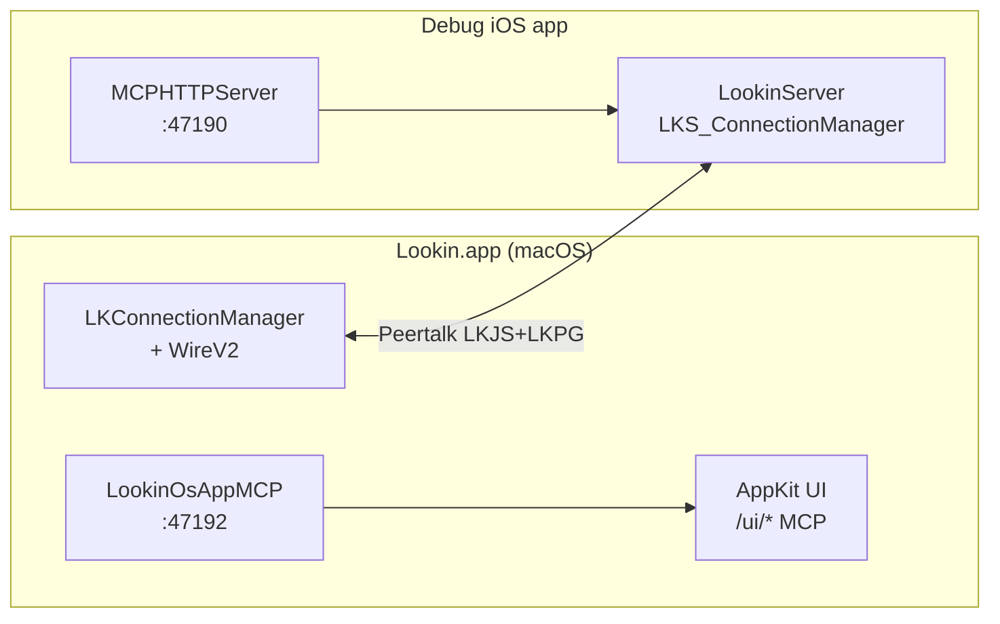

# Отчёт: рефакторинг Swift Lookin, LookinServer и LookinOsAppMCP

**Дата:** 2026-06-03  
**Примечание:** автогенерация для агентов; обновлять при крупных изменениях wire/MCP.

---

## 1. Executive summary

За последние месяцы проект Lookin прошёл крупную миграцию с Objective-C на Swift в двух независимых git-репозиториях (`Lookin/` — mac-клиент, `LookinServer/` — iOS SDK, плюс отдельный pod `LookinOsAppMCP/`). Главный архитектурный сдвиг — отказ от wire v1 (NSSecureCoding / `NSKeyedArchiver` по Peertalk) в пользу **wire v2** (JSON-конверты `LKJS` + бинарные кадры скриншотов `LKPG`). На iOS добавлен HTTP MCP на **47190** (`LookinServerMCP`); на macOS — отдельный pod **LookinOsAppMCP** с HTTP-сервером внутри Lookin.app (**47192** для Swift-рефактора, **47191** для ObjC baseline). Автоматизация агентов опирается на bash-verify с golden fixtures и режимом `SKIP_OBJC_BASELINE=1` (swift-only), а не на прямое подключение HTTP MCP к Cursor. После миграции остаются намеренные legacy-остатки: Peertalk с `@objc`, AppKit UI с селекторами, три `.h` в `Src/`, runtime whitelist (`NSClassFromString`) и ObjC-мост исключений.

---

## 2. Архитектура до / после

### До (эталон `Lookin-baseline+mcp` / `LookinServer-baseline+mcp`)

| Слой | Технология |
|------|------------|
| Mac-клиент | Objective-C, ReactiveObjC |
| iOS SDK | ObjC в `Src/Main/**`, NSCoding-модели |
| Транспорт | Peertalk, wire v1 (keyed archive) |
| MCP mac | Встроен в baseline-клиент (порт 47191) |
| MCP iOS | Отсутствует или минимален в stock QMUI |

### После (редактируемые `Lookin/`, `LookinServer/`)

| Слой | Технология |
|------|------------|
| Mac-клиент | Swift, RxSwift + RxRelay (`BehaviorRelay`/`PublishRelay`); legacy события — `LookinRACSignalRx` / `PublishSubject<Any>` |
| iOS SDK | Swift-модули в `LookinServer/Sources/**` |
| Транспорт | Peertalk + **wire v2 only** |
| Wire payload | `WireRequestEnvelope` / `WireResponseEnvelope` (Codable JSON), скриншоты `LKPG` |
| Файлы `.lookin` | `LKJ2` + JSON (`WireLookinFileCodec`), legacy v1 не открывается |
| MCP iOS | `MCPHTTPServer` → `127.0.0.1:47190` (subspec `MCP`) |
| MCP mac | Pod `LookinOsAppMCP` → `127.0.0.1:47192` (Swift Lookin) |



Stock QMUI Lookin.app с NSCoding **не поддерживается** — только пара Swift-клиент + Swift LookinServer (см. `MacLookinClientCompatibility.md`).

---

## 3. LookinServer — ключевые изменения

| Область | Что сделано |
|---------|-------------|
| **Wire v2** | `LKWireCodecV2`, `Wire/*` модели, `WireRequestResponseMapper`, negotiation `minWireVersion: 2`; live Peertalk и `.lookin` на диске — только v2 |
| **Connection** | `LKS_ConnectionManager` + `+WireV2`: decode JSON-запросов, encode ответов, буфер скриншотов до появления oid в иерархии |
| **Shared models** | Модели иерархии/атрибутов в `LookinServerShared/`; снят `@objc(Lookin*)` с wire-моделей (gate: 0) |
| **LookinSharedLegacyConstants** | Swift-файл с портами USB/симулятора, error codes, `LOOKIN_*` C-алиасами для mac-клиента (замена `LookinDefines.h`) |
| **Categories** | `LookinServerCategories/` — UIKit swizzling, CALayer/UIView и т.д. на Swift |
| **Core** | Makers, blueprint, invocation — `LookinServerCore/` |
| **Peertalk** | `LookinServerPeertalk/` — порт на Swift, `@objc(Lookin_PT*)` сохранён |
| **MCP iOS :47190** | `LookinServerMCP/`: `MCPHTTPServer`, `MCPHTTPHandler`; старт из `LKS_ConnectionManager` через `NSClassFromString` |
| **Src/.h cleanup** | Удалены десятки `.h/.m` из `Src/Main`; осталось **6 файлов** (3 пары bridge + `LookinDefines.h` + `LookinIvarTrace.h`) |
| **CocoaPods** | Единый unified pod target, subspecs `Swift` + `MCP`; install helper для git source |
| **Тесты** | Расширены `LookinServerSharedTests` (round-trip wire, codec, ping JSON) |

### MCP iOS (порт 47190) — маршруты

| Method | Path | Назначение |
|--------|------|------------|
| GET | `/status` | Активность, имя приложения, экран |
| GET | `/hierarchy` | Дерево view/layer на **подключённом iOS** |
| GET | `/tap-targets` | Цели для тапа |
| GET | `/wire-roundtrip`, `/wire-v2-selftest` | Диагностика wire v2 |
| GET/POST | `/view/:oid/attributes` | Атрибуты / модификация |
| GET | `/view/:oid/screenshot` | PNG (base64 в JSON) |
| POST | `/tap`, `/swipe` | UI automation на симуляторе |

Запуск: subspec `['Swift', 'MCP']`, Debug only; совместимость с `lookin-mcp-ios` / `npx lookin-mcp-ios` в Cursor.

---

## 4. Mac-клиент (`Lookin/LookinClient/`) — ключевые изменения

| Область | Что сделано |
|---------|-------------|
| **Connection + WireV2** | `LKConnectionManager+WireV2.swift`: encode/decode envelope, парсинг `LKPG`, push 303–304; без `NSDictionary` в wire payload |
| **UI migration** | Весь `LookinClient` — Swift; **0** `.m` в Sources (gate G0); удалён пустой bridging header |
| **Rx / RxRelay** | `pod 'RxRelay'`; менеджеры/DS: private `BehaviorRelay` / `PublishRelay`, публичные `*Observable`; **0** `RACObserve` (gate G7). Стиль: skill [Jumak rxswift](https://github.com/kimkyuchul/Jumak/tree/main/.agents/skills/rxswift) → `Lookin/.cursor/skills/rxswift/` |
| **ShortCocoa** | `struct ShortCocoa` + `enum LookinSCConversion`; **0** `@objc(ShortCocoa)` (gate G9); fluent API без associated objects |
| **@objc Phase E** | Сужение `@objc` / снятие `@objcMembers` в Base, Static, Console, Connection |
| **Phase F (AppKit + @objc)** | **0** `import Cocoa` (gate **G11**); снято ~145 redundant `@objc(LK*)` на классах; **91** `@objc(` total (gate **G12**); `audit_client_objc.sh`; `LKBaseControl.onClick` |
| **LookinOsAppMCP** | `AppDelegate` реализует `LKOsAppMCPDataSource`, сервер на **47192** |
| **Build fix** | `c8d3d45` — восстановлен `LKHierarchyRowView` в inspector table |
| **Verify infra** | Десятки новых скриптов Python/bash, golden fixtures, `lookin_write_latest_summary.sh` |

Инвентарь `@objc` (актуальный gate `count_swift_objc.sh`):

- `LookinServerShared @objc(Lookin*)`: **0**
- `Src/Main *.h`: **3**
- `LookinClient @objc(` total: **91** (после Phase F; селекторы, protocols, Connection MCP)
- `LookinServer Sources @objc(`: **210** (Peertalk, runtime handlers, categories)

---

## 5. LookinOsAppMCP — что это и чем отличается от iOS MCP

### Что это

**LookinOsAppMCP** — отдельный CocoaPods-модуль (`LookinOsAppMCP/`, ObjC), подключаемый к mac-клиенту:

```ruby
pod 'LookinOsAppMCP', :path => '../LookinOsAppMCP/'
```

Реализация: `LKOsAppMCPServer` (Network.framework `nw_listener`) + `LKOsAppMCPHandler` (разбор HTTP). Данные берёт у `AppDelegate` через протокол `LKOsAppMCPDataSource` (`mcp_currentHierarchyInfo`, `mcp_inspectorUIState`, automation `mcp_openInspectorForAutomation` и др.).

Это **не** Cursor MCP-сервер из `.cursor/mcp.json` — это HTTP API **внутри** Lookin.app для verify-скриптов и headless automation.

### Endpoints (mac LookinOsAppMCP)

| Method | Path | Назначение |
|--------|------|------------|
| GET | `/status` | Подключено ли iOS-приложение |
| GET | `/hierarchy` | iOS-дерево (когда есть соединение) |
| GET | `/ui/hierarchy` | **NSView-дерево самого Lookin.app** (inspector UI) |
| GET | `/ui/state`, `/ui/client-state` | Состояние UI клиента |
| GET | `/ui/tap-targets` | Кликабельные цели в mac UI |
| POST | `/ui/tap` | Синтетический тап |
| POST | `/ui/open-inspector` | Вход в inspector (только Swift; baseline ObjC — нет) |
| GET | `/ui/view/{oid}/screenshot` | Скриншот NSView |
| GET | `/view/{oid}/screenshot` | Скриншот iOS item |
| GET/POST | `/ui/preview/*`, `/ui/event-log/*` | Preview layer, event log |
| POST | `/action/reload` | Перезагрузка иерархии |

### Порты

| Порт | Процесс |
|------|---------|
| **47190** | iOS debug app — `LookinServer.MCPHTTPServer` |
| **47191** | `Lookin-baseline+mcp.app` (ObjC эталон) |
| **47192** | `Lookin.app` Swift refactor (`AppDelegate` явно `start(onPort: 47192)`) |

### Verify-скрипты, использующие LookinOsAppMCP

| Скрипт | Роль |
|--------|------|
| `verify_ui_hierarchy_mcp.sh` | `/ui/hierarchy` + скриншоты views; golden или diff с ObjC |
| `verify_ui_tap_mcp.sh` | tap-targets → tap → `/ui/state` |
| `verify_ui_tap_targets_mcp.sh` | только targets + tap (Swift, `PORT=47192`) |
| `verify_ui_preview_mcp.sh` | preview state/structure/screenshots |
| `lookin_osapp_mcp_tap_lib.sh` | общая библиотека: iOS demo → launch Lookin → MCP tap |

Типичный pipeline: симулятор + iOS MCP :47190 → Lookin.app :47192 → curl к `/ui/*`.

### Отличия от iOS MCP (47190)

| | iOS `LookinServerMCP` | mac `LookinOsAppMCP` |
|--|----------------------|----------------------|
| Язык | Swift | Objective-C |
| Хост | Debug iOS app | Lookin.app |
| Дерево по умолчанию | UIView/CALayer **inspectируемого** app | Плюс **mac UI** (`/ui/hierarchy`) |
| Wire selftest | `/wire-v2-selftest` | Нет (wire — через Peertalk) |
| Cursor | `lookin-ios` / `npx lookin-mcp-ios` | **Не** в Cursor MCP |
| Entitlement | N/A (симулятор) | `com.apple.security.network.server` в `Lookin.entitlements` |

Без `network.server` listener на 47191/47192 не поднимается при нормальном codesign (комментарий в `verify_ui_hierarchy_mcp.sh`).

### История pod LookinOsAppMCP (4 коммита)

| Hash | Описание |
|------|----------|
| `6eb0c50` | init |
| `4eebc8d` | add tap+swipe |
| `89322f9` | fix tap |
| `70a8c45` | add list tappable |

---

## 6. Verify / CI

### Режимы

| Режим | Env | Смысл |
|-------|-----|-------|
| **swift-only** (default) | `SKIP_OBJC_BASELINE=1` | Swift Lookin + golden fixtures, без сборки baseline |
| **parity** | `SKIP_OBJC_BASELINE=0` | ObjC :47191 vs Swift :47192 |

### Скрипты (симптом → скрипт)

| Симптом | Скрипт |
|---------|--------|
| Дерево inspector (mac UI) | `verify_ui_hierarchy_mcp.sh` |
| Tap / selection | `verify_ui_tap_mcp.sh` |
| Custom info iOS | `verify_custom_info_client.sh` |
| Wire v2 ping / LKJS | `verify_wire_v2_ping.sh` |
| Preview layers | `verify_ui_preview_mcp.sh` |
| Static gates | `run_legacy_gates.sh` |
| Nightly ObjC parity | `verify_parity_nightly.sh` |
| LookinServer E2E | `LookinServer/Scripts/run_full_verify.sh` |

### Golden fixtures (`Lookin/Scripts/fixtures/`)

- `ui-hierarchy-inspector-golden.norm` — нормализованное дерево inspector
- `tap-state-golden.txt` — состояние после tap
- `custominfo-baseline-golden.norm` — custom info
- Обновление: `update_golden_fixtures.sh`

### Артефакты

- `lookin-verify-logs/LATEST_SUMMARY.txt` — главный вывод для агентов
- DerivedData: `DerivedData-LookinRefactor`, `DerivedData-LookinBaseline` (не удалять между итерациями)

### Cursor MCP (проект)

- `lookin-verify` — запуск verify, ответ summary
- `lookin-ios` — iOS через `lookin-mcp-ios`
- HTTP в Lookin.app **не** регистрируется в Cursor (`.cursor/MCP_SETUP.md`)

---

## 7. Коммиты-вехи (по темам)

> Корень workspace **не** git-репозиторий; история — в подпапках `Lookin/`, `LookinServer/`, `LookinOsAppMCP/`.

### LookinServer — миграция на Swift

| Коммит | Тема |
|--------|------|
| `c3f7a44` | Swift MCP layer, scaffold `Sources/` |
| `d87ff2c`–`7e90e46` | HTTP server → ConnectionManager (предшественник 47190) |
| `7913b4a`–`b822710` | Shared/Core/Connection/Categories/Peertalk port |
| `6dc224b`, `b19a7b1` | Удаление мигрированных `.m` |
| `8e7fae4`, `3786b95`, `52c21dc` | Models, blueprint, Server/Others + MCP для Cursor |
| `1eefc7e`–`6c462aa` | Совместимость mac Lookin, wire fixes QMUI/CocoaPods |
| `a37fd50`, `c6c9608` | Unified pod, install helper |
| `ef859d5`, `818ce31` | `run_full_verify.sh`, wire verify scripts |
| `a56e687` | **to swift** (маркер полной миграции) |

### LookinServer — legacy cleanup (после stable)

| Коммит | Тема |
|--------|------|
| `34b2e13` | Gates + baseline objc/h |
| `32dc215`, `35d02cf` | Снятие `@objc` с enums и hierarchy models |
| `e47a6e8`, `f494f6a` | Уменьшение `.h`, podspec |
| `33a33a6` | Peertalk path @objc |
| `5f3f2ac`, `93bdf72` | `LKWireCodec` Swift-only, C constants для клиента |

### Lookin mac client

| Коммит | Тема |
|--------|------|
| `90f626d` | **to swift** |
| `bf31666` | Legacy gates (shared с Server) |
| `f804735` | `@objc` с enums |
| `5e66c16` | Удалён пустой bridging header |
| `45a4254`–`7c0b808` | Phase E: Base, Static, Console, ShortCocoa, Connection |
| `c8d3d45` | Fix `LKHierarchyRowView` |

Между `90f626d` и HEAD — **~5205** строк добавлено в основном verify-скриптами и fixtures (`git diff --stat`).

### LookinOsAppMCP

| Коммит | Тема |
|--------|------|
| `6eb0c50` → `70a8c45` | HTTP MCP для mac Lookin: init, tap/swipe, fixes, tap-targets |

---

## 8. Что осталось legacy

| Категория | Состояние |
|-----------|-----------|
| **`@objc(Lookin*)` на моделях** | **0** в Shared (gate) |
| **`import Cocoa`** | **0** в LookinClient (gate G11; использовать `import AppKit`) |
| **`@objc` всего** | Server ~210, Client **91** — селекторы, `@objc protocol`, Connection diagnostics |
| **`@objc(LK*)` на классах** | Сняты redundant (имя совпадало с Swift class); audit: `bash Lookin/Scripts/audit_client_objc.sh` |
| **`.h` в Src/** | **3** публичных заголовка + bridges (gate) |
| **Peertalk** | Swift с `@objc(Lookin_PTChannel)` — обязателен |
| **ObjC exception bridge** | `LookinObjCExceptionBridge.m`, `LKS_ObjCExceptionBridge.m` |
| **Runtime whitelist** | `LookinConfig`, `Lookin`, `LKS_MCPHTTPServer`, dynamic class names в handlers |
| **ReactiveObjC** | Точечно в UI/AppDelegate, не в Connection |
| **LookinOsAppMCP** | Целиком ObjC (намеренно, стабильный HTTP слой) |

---

## 9. Риски и рекомендации

### Риски

1. **Wire v2 only** — несовместимость со stock QMUI Lookin.app; любая регрессия wire ломает весь inspector.
2. **Два MCP на машине** — путаница портов 47190 (iOS) / 47191–47192 (mac); скрипты убивают stale :47190, но не mac-порты после demo.
3. **Codesign / entitlements** — без `network.server` verify hierarchy/tap падает на «port not listening».
4. **Pod drift** — после изменений `LookinSharedLegacyConstants` / podspec Server обязателен `cd Lookin && pod install`.
5. **Parity mode дорогой** — `SKIP_OBJC_BASELINE=0` требует две сборки Lookin.app; для CI лучше swift-only + nightly parity.
6. **LookinOsAppMCP на ObjC** — отдельный репозиторий; API `/ui/*` расширяется здесь, не в Swift-клиенте.

### Рекомендации

1. После любого изменения Connection/Wire — минимум `verify_wire_v2_ping.sh` + затронутый UI-скрипт (`hierarchy` / `tap` / `custom_info`).
2. Перед merge — `run_legacy_gates.sh` (быстро) + один полный UI verify.
3. Не читать в агент-контексте `ui_hierarchy-*.json` и PNG из `lookin-verify-logs/` — только `LATEST_SUMMARY.txt` и `head` diff-файлов.
4. Для сравнения с эталоном — grep одного символа в `*-baseline+mcp`, не правки baseline.
5. Документировать новые `/ui/*` routes в `LKOsAppMCPHandler.m` и заголовках verify-скриптов синхронно.
6. Долгосрочно: сокращать оставшиеся **91** `@objc` в клиенте только там, где нет `#selector`/KVO; новый UI-код — `import AppKit`, без `@objc(LK*)` на class без audit; не трогать Peertalk и runtime handlers на Server.

---

*Источники: `AGENTS.md`, `MacLookinClientCompatibility.md`, `LookinServer/Sources/README.md`, git log в `Lookin/`, `LookinServer/`, `LookinOsAppMCP/`, grep по кодовой базе, вывод `count_swift_objc.sh`. Baseline-деревья не читались (read-only по правилам workspace).*
